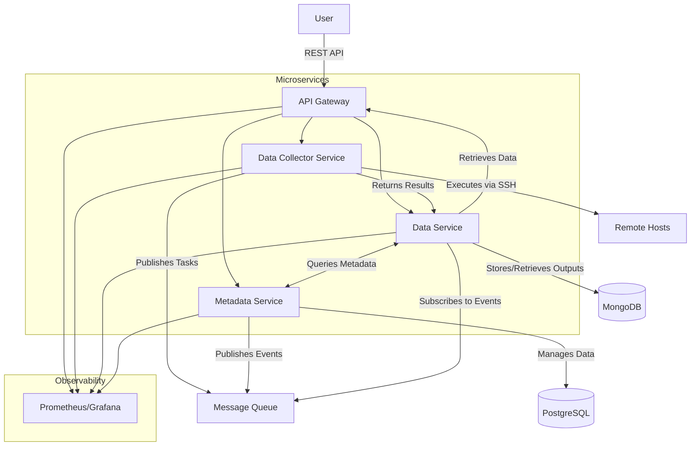

```mermaid
%%{init: {"config": {"look": "handDrawn", "theme": "forest"}}}%%
graph TD
    User -->|REST API| Gateway[API Gateway]

    subgraph Microservices
        Gateway --> DataCollectorService[Data Collector Service]
        Gateway --> DataService[Data Service]
        Gateway --> MetadataService[Metadata Service]
    end

    DataCollectorService -->|Publishes Tasks| Queue[Message Queue]
    DataCollectorService -->|Returns Results| DataService
    DataCollectorService -->|Executes via SSH| RemoteHosts[Remote Hosts]

    DataService <-->|Queries Metadata| MetadataService
    DataService -->|Stores/Retrieves Outputs| MongoDB[(MongoDB)]
    DataService -->|Retrieves Data| Gateway

    MetadataService -->|Manages Data| PostgreSQL[(PostgreSQL)]
    MetadataService -->|Publishes Events| Queue
    DataService -->|Subscribes to Events| Queue

    subgraph Observability
        Gateway --> Monitoring[Prometheus/Grafana]
        DataCollectorService --> Monitoring
        DataService --> Monitoring
        MetadataService --> Monitoring
    end


```