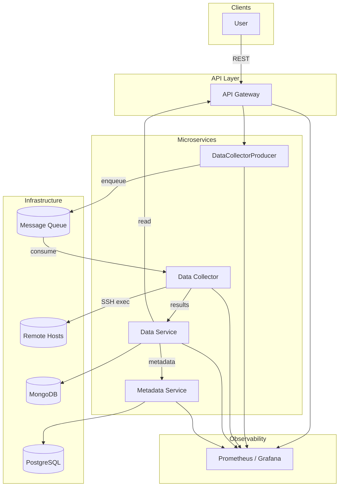
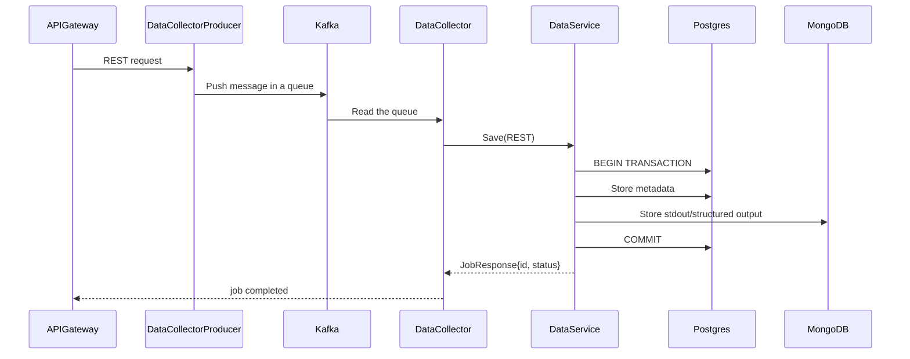
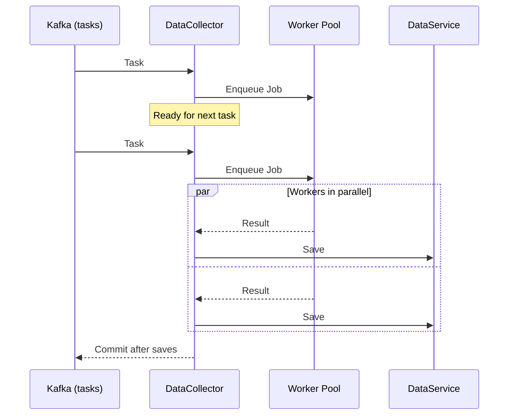

# HAM – Healthcare Asset Map

## Overview
HAM (Healthcare Asset Map) is a microservice-based system for collecting, processing, and storing configuration and operational data from medical equipment across distributed environments.  

Key ideas:
- **Message-driven** architecture with Kafka.  
- **Worker pool** concurrency in the DataCollector.  
- **PostgreSQL** for structured metadata and **MongoDB** for unstructured artifacts.  
- **Prometheus/Grafana** for observability.  

## Architecture Diagram
The diagram below shows the high-level architecture.  
- **API Gateway** is the entry point for users.  
- **DataCollectorProducer** accepts API requests and pushes them into the **Message Queue** (Kafka).  
- **DataCollector** consumes tasks, executes them on remote hosts via SSH, and returns results.  
- **DataService** stores results in **PostgreSQL** (metadata) and **MongoDB** (artifacts/output).  
- **MetadataService** manages metadata and interacts with PostgreSQL.  
- **Prometheus/Grafana** provide observability for all components.

## Data Flow
1. This sequence shows how a request moves through the system:
2. A user sends a request via the API Gateway.
3. DataCollectorProducer pushes the request into Kafka.
4. DataCollector consumes from Kafka, executes tasks on remote hosts, and forwards results to DataService.
5. DataService stores metadata in PostgreSQL and artifacts in MongoDB.
6. The final job response is returned back through the API Gateway.

## Worker Pool Concept

The DataCollector uses a worker pool pattern to handle multiple tasks concurrently.
When a task arrives, it is immediately enqueued in the worker pool, and DataCollector is free to accept the next task.
Workers run in parallel, execute jobs on remote hosts, return results to the DataCollector, which then persists them through DataService.

