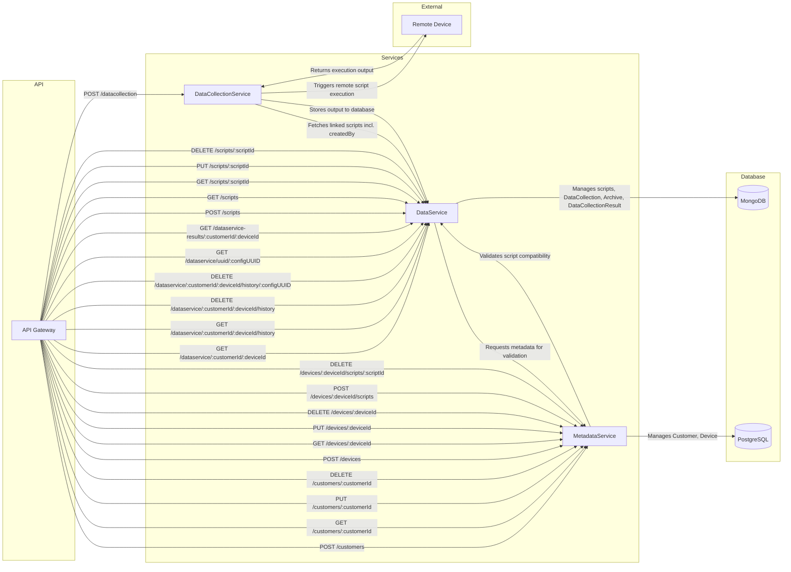

API diagram



 Resource Hierarchy Diagram

 ```mermaid
graph LR
  A[API Root]

  subgraph Data Collection
    B[datacollection]
  end

  subgraph Data Service
    C[dataservice]
    C --> G[dataservice/:customerId/:deviceId]
    G --> H[dataservice/:customerId/:deviceId/history]
    H --> I[dataservice/:customerId/:deviceId/history/:configUUID]
    C --> J[dataservice/uuid/:configUUID]
    C --> K[dataservice-results/:customerId/:deviceId]
  end

  subgraph Customers
    D[customers]
    D --> L[customers/:customerId]
  end

  subgraph Devices
    E[devices]
    E --> M[devices/:deviceId]
    M --> N[devices/:deviceId/scripts]
    N --> O[devices/:deviceId/scripts/:scriptId]
  end

  subgraph Scripts
    F[scripts]
    F --> P[scripts/:scriptId]
  end

  A --> B
  A --> C
  A --> D
  A --> E
  A --> F

```