API diagram

```mermaid
flowchart TD
  A[API Gateway] -->|POST /datacollection| B[DataCollectionService]
  A -->|GET /dataservice/:customerId/:deviceId| C[DataService]
  A -->|GET /dataservice/:customerId/:deviceId/history| C
  A -->|DELETE /dataservice/:customerId/:deviceId/history| C
  A -->|DELETE /dataservice/:customerId/:deviceId/history/:configUUID| C
  A -->|GET /dataservice/uuid/:configUUID| C
  A -->|GET /dataservice-results/:customerId/:deviceId| C
  A -->|POST /customers| D[MetadataService]
  A -->|GET /customers/:customerId| D
  A -->|PUT /customers/:customerId| D
  A -->|DELETE /customers/:customerId| D
  A -->|POST /devices| D
  A -->|GET /devices/:deviceId| D
  A -->|PUT /devices/:deviceId| D
  A -->|DELETE /devices/:deviceId| D
  A -->|POST /devices/:deviceId/scripts| D
  A -->|DELETE /devices/:deviceId/scripts/:scriptId| D
  A -->|POST /scripts| C
  A -->|GET /scripts| C
  A -->|GET /scripts/:scriptId| C
  A -->|PUT /scripts/:scriptId| C
  A -->|DELETE /scripts/:scriptId| C

  B -->|Triggers remote script execution| RemoteDevice
  RemoteDevice -->|Returns execution output| B
  B -->|Fetches linked scripts incl. createdBy| C
  B -->|Stores output to database| C

  C -->|Manages scripts, DataCollection, Archive, DataCollectionResult| MongoDB[(MongoDB)]
  C -->|Requests metadata for validation| D
  D -->|Manages Customer, Device| PostgreSQL[(PostgreSQL)]
  D -->|Validates script compatibility| C
```



 Resource Hierarchy Diagram

 ```mermaid
graph TD
  A[API Root] --> B[datacollection]
  A --> C[dataservice]
  A --> D[customers]
  A --> E[devices]
  A --> F[scripts]

  C --> G[dataservice/:customerId/:deviceId]
  G --> H[dataservice/:customerId/:deviceId/history]
  H --> I[dataservice/:customerId/:deviceId/history/:configUUID]
  C --> J[dataservice/uuid/:configUUID]
  C --> K[dataservice-results/:customerId/:deviceId]

  D --> L[customers/:customerId]

  E --> M[devices/:deviceId]
  M --> N[devices/:deviceId/scripts]
  N --> O[devices/:deviceId/scripts/:scriptId]

  F --> P[scripts/:scriptId]
```