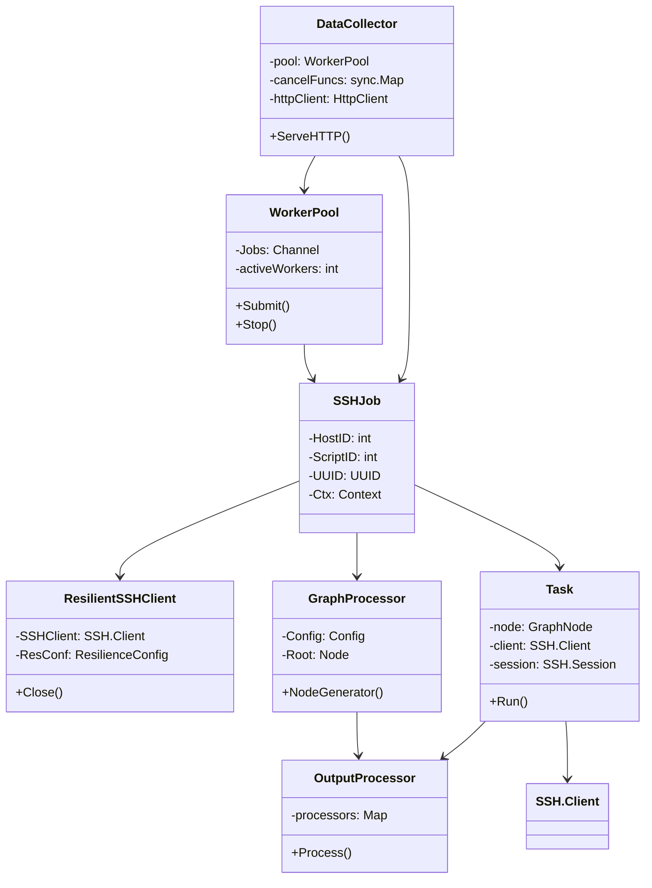
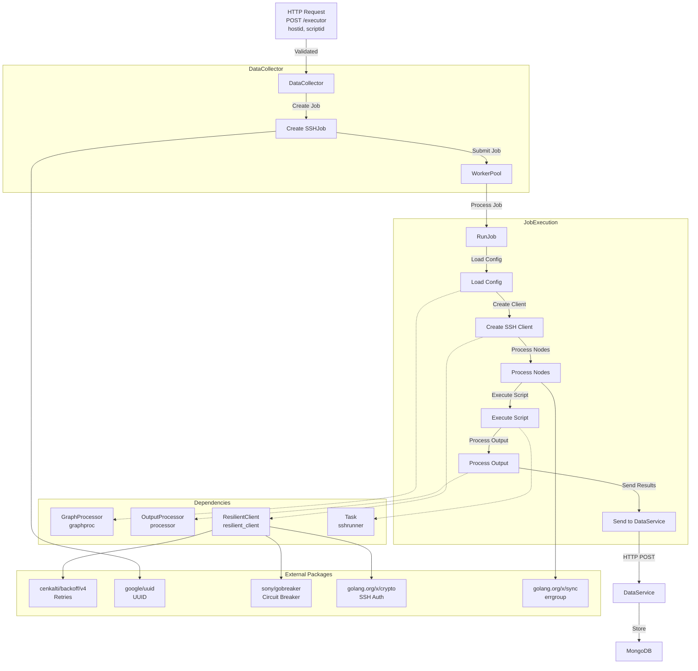

# DataCollector Microservice

## Overview
The `DataCollector` microservice is a component of a distributed system designed to execute scripts on remote hosts via SSH, process the output, and forward the results to a `DataService` for storage and further processing. It serves as an executor for remote script execution, enabling automated data collection from network devices or servers. The microservice is built in Go, leveraging concurrency, resilience patterns, and a graph-based configuration to ensure robust and scalable operation.

### Purpose
- **What**: Executes user-defined scripts on remote hosts and processes their output.
- **Why**: Enables automated, scalable data collection from distributed systems, such as network devices, for monitoring, diagnostics, or configuration management.
- **Who**: Used by system administrators, DevOps engineers, or automated systems requiring remote data collection.

### Key Features
- **Remote Script Execution**: Runs scripts on remote hosts via SSH, supporting configurable scripts defined in a JSON graph.
- **Output Processing**: Processes script output (e.g., trimming, key-value parsing) based on node-specific configurations.
- **Concurrency**: Uses a worker pool to handle multiple SSH jobs concurrently, optimizing performance.
- **Resilience**: Implements retries and circuit breakers for robust SSH connections.
- **Extensibility**: Supports a graph-based configuration for flexible script execution workflows.
- **Integration**: Sends processed results to a `DataService` microservice via HTTP for storage in MongoDB.

## What It Does
The `DataCollector` microservice performs the following core functions:
1. **Receives HTTP Requests**: Accepts POST requests at `/executor` with a JSON payload containing `hostid` and `scriptid`.
2. **Validates Requests**: Ensures the request is well-formed using validation utilities.
3. **Creates SSH Jobs**: Generates an `SSHJob` with a unique UUID, host ID, script ID, and execution context.
4. **Manages Concurrency**: Submits jobs to a worker pool for concurrent processing.
5. **Loads Configuration**: Reads a JSON graph configuration (e.g., `docconfig.json`) defining scripts and processing rules.
6. **Executes Scripts**: Connects to remote hosts via SSH, executes scripts defined in the graph, and captures output.
7. **Processes Output**: Applies processors (e.g., `TrimProcessor`, `KeyValueProcessor`) to format script output.
8. **Forwards Results**: Sends the processed graph with results to the `DataService` microservice via HTTP POST.
9. **Handles Failures**: Uses retries, circuit breakers, and context cancellation to manage errors gracefully.

## How It Works
The `DataCollector` microservice is implemented as a Go-based HTTP server with a modular architecture. Below is an overview of its components, data flow, and technical implementation.

### Architecture
The microservice consists of the following key components:
- **HTTP Server (`serverutil`)**: Handles incoming POST requests at `/executor` and validates payloads.
- **DataCollector Handler (`datacollector-service.go`)**: Orchestrates job creation, submission, and result forwarding.
- **Worker Pool (`workerpool`)**: Manages concurrent job execution with a pool of workers.
- **SSH Runner (`sshrunner.go`)**: Coordinates script execution on remote hosts and output processing.
- **Resilient SSH Client (`resilient_client.go`)**: Establishes robust SSH connections with retries and circuit breakers.
- **Graph Processor (`graphproc`)**: Loads and validates a JSON graph defining script execution nodes and dependencies.
- **Output Processor (`processor`)**: Processes script output based on node-specific configurations.
- **Task (`sshrunner.go`)**: Executes individual scripts on remote hosts and captures results.

### Data Flow
The data flow through the microservice is as follows:
1. **HTTP Request**: A client sends a POST request to `/executor` with `hostid` and `scriptid`.
2. **Job Creation**: The handler creates an `SSHJob` with a unique UUID and submits it to the worker pool.
3. **Graph Loading**: The SSH runner loads a JSON graph configuration (e.g., `docconfig.json`) defining scripts and processors.
4. **SSH Execution**: A resilient SSH client connects to the remote host, and tasks execute scripts defined in the graph nodes.
5. **Output Processing**: The output processor formats script output (e.g., trims whitespace, parses key-value pairs).
6. **Result Forwarding**: The processed graph is sent to the `DataService` at `http://localhost:8082/dataservice` via HTTP POST.
7. **Storage**: The `DataService` stores the results in MongoDB.

### Class Diagram
Below is a Mermaid class diagram illustrating the core components and their relationships:



### Flowchart
Below is a Mermaid flowchart depicting the data flow:



## External Dependencies
The `DataCollector` microservice relies on the following external Go packages:
- **`github.com/cenkalti/backoff/v4` (v4.3.0)**: Implements exponential backoff for SSH connection retries.
- **`github.com/google/uuid` (v1.6.0)**: Generates unique identifiers for jobs and executions.
- **`github.com/sony/gobreaker` (v1.0.0)**: Provides circuit breaker functionality for SSH connections.
- **`golang.org/x/crypto` (v0.37.0)**: Handles SSH authentication (e.g., public key authentication).
- **`golang.org/x/sync` (v0.13.0)**: Uses `errgroup` for concurrent node processing.

## Setup and Running
### Prerequisites
- **Go**: Version 1.22.5 or later.
- **SSH Access**: Configured SSH private key (e.g., `~/.ssh/...`) for remote hosts.
- **DataService**: Running at `http://localhost:8082/dataservice` with MongoDB.
- **Configuration**: A JSON graph configuration file (e.g., `docconfig.json`) defining scripts and processors.


### Running
1. Start the `DataService` microservice (if not already running).
2. Run the `DataCollector` microservice:
   ```bash
   ./datacollector
   ```
3. The server listens on `http://localhost:8081/executor` for POST requests.

### Example Request
Send a POST request to trigger script execution:
```bash
curl -X POST http://localhost:8081/executor \
  -H "Content-Type: application/json" \
  -d '{"hostid": 1, "scriptid": 100}'
```

